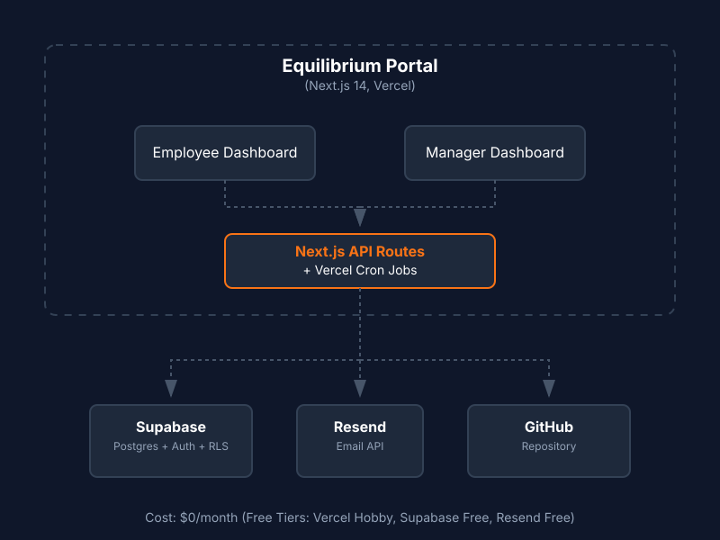

# Equilibrium Real-Time Performance Alignment System

## Live Demo: [URL]

## Demo Credentials
| Role | Email | Password |
|------|-------|----------|
| Employee | employee@equilibrium.com | Demo@1234 |
| Manager | manager@equilibrium.com | Demo@1234 |
| Admin | admin@equilibrium.com | Demo@1234 |

## Features Implemented
✅ Phase 1 — Goal Creation & Approval
✅ Phase 2 — Achievement Tracking  
✅ Shared Goals with Sync
✅ Quarterly Check-ins
✅ Audit Trail
✅ Role-based Access Control
✅ Analytics Dashboard with 7 charts
✅ Escalation Engine
✅ Email Notifications (Resend)
✅ CSV + Excel Export
✅ PDF Goal Sheet Export
✅ Real-time Notifications
✅ Demo Mode with Quick Role Switching

## Architecture
Next.js 14 + Supabase + Vercel + Resend

## Cost Optimisation
Total hosting cost: $0/month using free tiers
- **Vercel:** Free hobby plan
- **Supabase:** Free tier (500MB DB, 50K auth users)
- **Resend:** Free tier (3000 emails/month)
